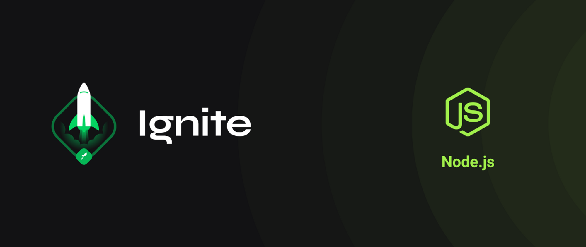

# Ignite: Desafio 01 - Conceitos do Node.js



## Sobre o desafio

Nesse desafio, você deverá criar uma aplicação para treinar o que aprendeu até agora no Node.js!

Essa será uma aplicação para gerenciar tarefas (em inglês _todos_). Será permitida a criação de um usuário com `name` e `username`, bem como fazer o CRUD de *todos*:

- Criar um novo _todo_;
- Listar todos os _todos_;
- Alterar o `title` e `deadline` de um _todo_ existente;
- Marcar um _todo_ como feito;
- Excluir um _todo_;

Tudo isso para cada usuário em específico (o `username` será passado pelo header).

## Como executar o projeto

1. Clone o repositório

```bash
git clone https://github.com/CleysonPH/ignite-node-desafio-01-conceitos-iniciais.git
```

2. Instale as dependências

```bash
yarn
# ou
npm install
```

3. Execute a aplicação

```bash
yarn dev
# ou
npm run dev
```

## Como executar os testes

```bash
yarn test
# ou
npm run test
```
